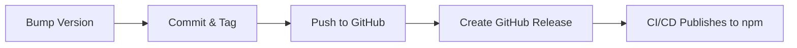

# Version Management Reference

## Architecture

### Single Source of Truth: package.json

All version information flows from `package.json`:

```
package.json
    │
    ├─> src/index.mjs (reads at runtime via require)
    ├─> Git tags (created by version script)
    └─> npm registry (reads during publish)
```

### Implementation Details

**src/index.mjs:**
```javascript
import { createRequire } from "module";
const require = createRequire(import.meta.url);
const pkg = require("../package.json");

const server = new McpServer({
  name: "calculator",
  version: pkg.version,  // ← reads from package.json
});
```

**Version bump script** (`scripts/version.mjs`):
- Reads current version from package.json
- Calculates new version based on semver rules
- Updates package.json
- Creates git commit and tag

## Semantic Versioning Guide

Given a version number MAJOR.MINOR.PATCH:

1. **MAJOR** version when you make incompatible API changes
   - Example: Removing or renaming MCP tools
   - Example: Changing tool parameter schema (breaking)
   - Example: Dropping Node.js version support

2. **MINOR** version when you add functionality in a backward compatible manner
   - Example: Adding new MCP tools
   - Example: Adding optional tool parameters
   - Example: Performance improvements

3. **PATCH** version when you make backward compatible bug fixes
   - Example: Fixing calculation errors
   - Example: Fixing error messages
   - Example: Dependency updates (security)

## Files That Reference Version

When version is bumped, these files are affected:

| File | How Updated | When |
|------|-------------|------|
| `package.json` | Direct edit | By version script |
| `yarn.lock` | Auto-updated | After package.json change |
| `src/index.mjs` | No change needed | Reads at runtime |
| Git tags | Created | By version script |

## Publishing Workflow



1. **Local**: Run version bump script
2. **Local**: Review and push changes + tag
3. **GitHub**: Create release from tag
4. **GitHub Actions**: `publish-npm.yml` workflow triggers
5. **npm**: Package published with provenance

